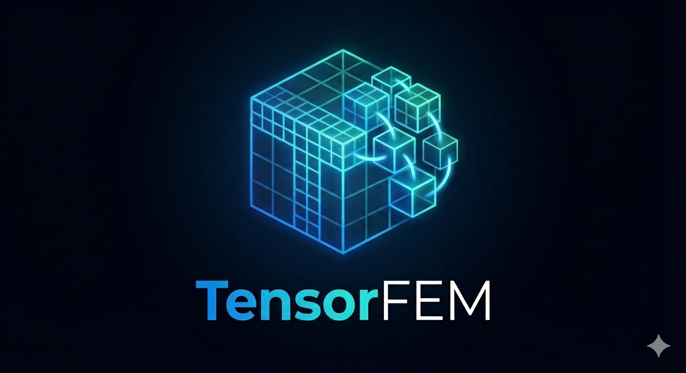

# TensorFEM
Matrix-free Finite Elements optimized for modern hardware.
> #### This repository is currently empty; I will move the currently private code into it for the public release (expected: April 2026).

**TensorFEM** is a high-performance python library for Finite Element Methods (FEM) designed from the ground up to leverage the computational power of modern parallel architectures. 

---

## Key Features & Design Philosophy

### 🚀 Hardware-Aware Design
TensorFEM is engineered specifically for modern hardware. We utilize specialized memory layouts and access patterns to ensure maximum memory coalescence and effective utilization of high-bandwidth memory. Every kernel is optimized to map the mathematical operations directly to the underlying hardware capabilities.

### 🧩 Tensor-Product Elements
At the core of TensorFEM is the exploitation of **tensor-product elements**. This allows for the use of efficient Kronecker-product sum-factorization kernels, which reduces the computational complexity of element-wise operations from $O(p^{2d})$ to $O(p^{d+1})$, where $p$ is the polynomial degree and $d$ is the dimension.

### 🐍 High performance made simple
TensorFEM is implemented in Python to keep the API concise and accessible, prioritizing developer productivity and readable code. At the same time, performance-critical kernels are compiled just-in-time so that compilation is transparent and fast; you get a native throughput without long compile cycles or deep C++ build complexity. Check out the perfomance section.

### 🔧 Easy setup & transparency
TensorFEM is a pure-Python library — there are no C/C++ components embedded in the library code. Installation requires no source compilation: simply `pip install` the project dependencies and you are good to go. 

---

## Performance Preview

Below is a representative evaluation framework for a 3D Poisson problem (120M DoF). 

### Poisson Operator  Evaluation
| Polynomial Degree $p$ | GDoF/s (Double) | GDoF/s (Single) |
| :---: | :---: | :---: |
| $p=3$ | 1.532 | 8.161 |
| $p=7$ | 3.004 | 13.608 |

*Note: results for $p=1$ are omitted pending further optimization.*

These measurements report the performance of a matrix-free volumetric operator using pre-assembled 1D mass and stiffness matrices. The volumetric kernel applies the 3D Laplace action via tensor-product separability as

$$L\,u = (K_x M_y M_z + M_x K_y M_z + M_x M_y K_z)\,u,$$

where $M_\ast$ and $K_\ast$ are the one-dimensional mass and stiffness matrices on each coordinate axis. In implementation we precompute the 1D matrices at quadrature and evaluate the three separable passes using sum-factorization.

---

## Roadmap & Current Progress

TensorFEM is currently a **Work in Progress**.

| Component | Progress | Status | Comments |
| :--- | ---: | :--- | :--- |
| Mesh Handling | 90% ▓▓▓▓▓▓▓▓▓░ | Done | Missing face orientations |
| Adaptive Mesh Refinement (AMR) | 95% ▓▓▓▓▓▓▓▓▓░ | Final enchantments |  |
| Hanging Node Constraints | 90% ▓▓▓▓▓▓▓▓▓░ | Done |  Missing face orientations |
| Lagrange element | 90% ▓▓▓▓▓▓▓▓▓░ | Done |  |
| Discontinuous Galerkin | 20% ▓▓░░░░░░░░ | Early stages | Missing: face integration, adaptivity  |
| Geometric Multigrid | 35% ▓▓▓░░░░░░░ | Early stages | Local smoothing (WIP) |
| Raviart-Thomas (DG) | 0% ░░░░░░░░░░ | Planned |  |
| Krylov Solvers | 0% ░░░░░░░░░░ | Planned | Full implementation |
| Distributed Computing | 0% ░░░░░░░░░░ |  |  |
| Non-nested multigrid | 0% ░░░░░░░░░░ |  |  |

---

## Literature & Theoretical Background

The development of TensorFEM is informed by cutting-edge research in high-order methods and hardware-aware scientific computing.

1.  [Smoothers with localized residual computations for geometric multigrid methods](https://arxiv.org/abs/2407.02100)
2.  [Local Solvers for High-Order Patch Smoothers via p-Multigrid](https://arxiv.org/abs/2510.17785)
3.  [Towards Matrix-Free Patch Smoothers for the Stokes Problem: Evaluating Local p-Multigrid Solvers](https://arxiv.org/abs/2601.13230)
4.  [Multigrid p-Robustness at Jacobi Speeds: Efficient Matrix-Free Implementation of Local p-Multigrid Solvers](https://arxiv.org/abs/2512.02577)

More papers on design of TensorFEM are coming up.

---

## Contributing

TensorFEM is under active development and feedback is welcome. If you have a feature request or idea, please open an issue to start the discussion.

## Work in Progress

> This project is currently under active development. It will be released before July 2026.